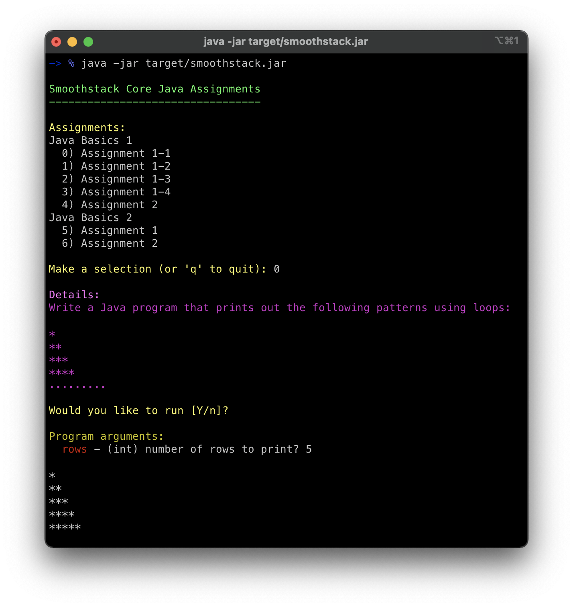

# Project for Smoothstack Java Assignments

This is a project of assignments from Smoothstack core Java training.
Classes can be run individually or run interactively by running the Main class or running the jar.
The classes are structured to accept arguments either when running the class individually or through the interactive session.

## Running interactive session

```shell
$ git clone https://github.com/psamsotha-ss/smoothstack-java-assignments.git
$ cd smoothstack-java-assignments
$ ./mvnw clean package
$ java -jar target/smoothstack.jar
```



## Source code links

* **Java Basics 1**
    * [Assignment 1-1](src/main/java/javabasics1/Assignment1_01.java)
    * [Assignment 1-2](src/main/java/javabasics1/Assignment1_02.java) 
    * [Assignment 1-3](src/main/java/javabasics1/Assignment1_03.java)
    * [Assignment 1-4](src/main/java/javabasics1/Assignment1_04.java)
    * [Assignment 2](src/main/java/javabasics1/Assignment2.java)
* **Java Basics 2**
    * [Assignment 1](src/main/java/javabasics2/Assignment1.java)
    * [Assignment 2](src/main/java/javabasics2/Assignment2.java)
    * [Assignment 3](src/main/java/javabasics2/Assignment3.java)
* **Java Basics 3**
    * [Assignment 1](src/main/java/javabasics3/Assignment1.java)
    * [Assignment 2](src/main/java/javabasics3/Assignment2.java)
    * [Assignment 3](src/main/java/javabasics3/Assignment3.java)
* **Java Basics 4**
    * [Assignment 1](src/main/java/javabasics4/Assignment1.java)
    * [Assignment 2](src/main/java/javabasics4/Assignment2.java)
    * [Assignment 3](src/main/java/javabasics4/Assignment3.java)
    * [Assignment 4](src/test/java/javabasics4/LineTest.java)
* **Java Basics 5**
    * [Assignment 1-1](src/main/java/javabasics5/Assignment1_01.java) ([tests](src/test/java/javabasics5/Assignment1_01Test.java))
    * [Assignment 1-2](src/main/java/javabasics5/Assignment1_02.java) ([tests](src/test/java/javabasics5/Assignment1_02Test.java))
    * [Assignment 1-3](src/main/java/javabasics5/Assignment1_03.java) ([tests](src/test/java/javabasics5/Assignment1_03Test.java))
    * [Assignment 2](src/main/java/javabasics5/Assignment2.java) ([tests](src/test/java/javabasics5/Assignment2Test.java))
* **Week 1 Assignments**
    * [Assignment 1](src/main/java/week1assignments/Assignment1.java) ([tests](src/test/java/week1assignments/Assignment1Test.java))
    * [Assignment 2](src/main/java/week1assignments/Assignment2.java) ([tests](src/test/java/week1assignments/Assignment2Test.java))
    * [Assignment 3](src/main/java/week1assignments/Assignment3.java) ([tests](src/test/java/week1assignments/Assignment3Test.java))
    * [Assignment 4](src/main/java/week1assignments/Assignment4.java) ([tests](src/test/java/week1assignments/Assignment4Test.java))
    * [Assignment 5](src/main/java/week1assignments/Assignment5.java) ([tests](src/test/java/week1assignments/Assignment5Test.java))
    * [Assignment 6](src/main/java/week1assignments/Assignment6.java) ([tests](src/test/java/week1assignments/Assignment6Test.java))
  